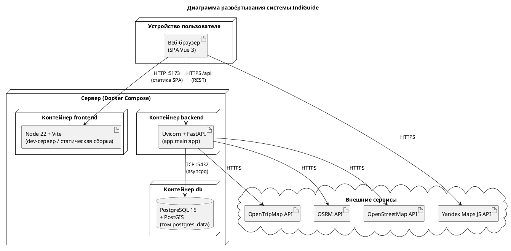

# Рисунок 3 — Диаграмма развёртывания

Вставьте код ниже в онлайн-редактор PlantUML (https://www.plantuml.com/plantuml).

```plantuml
@startuml
title Диаграмма развёртывания системы IndiGuide

node "Устройство пользователя" {
  artifact "Веб-браузер\n(SPA Vue 3)" as browser
}

node "Сервер (Docker Compose)" {
  node "Контейнер frontend" {
    artifact "Node 22 + Vite\n(dev-сервер / статическая сборка)" as fe
  }
  node "Контейнер backend" {
    artifact "Uvicorn + FastAPI\n(app.main:app)" as be
  }
  node "Контейнер db" {
    database "PostgreSQL 15\n+ PostGIS\n(том postgres_data)" as pg
  }
}

cloud "Внешние сервисы" {
  artifact "OpenTripMap API" as otm
  artifact "OSRM API" as osrm
  artifact "OpenStreetMap API" as osm
  artifact "Yandex Maps JS API" as ya
}

browser --> fe : "HTTP :5173\n(статика SPA)"
browser --> be : "HTTPS /api\n(REST)"
browser --> ya : "HTTPS"
be --> pg : "TCP :5432\n(asyncpg)"
be --> otm : "HTTPS"
be --> osrm : "HTTPS"
be --> osm : "HTTPS"

@enduml
```
