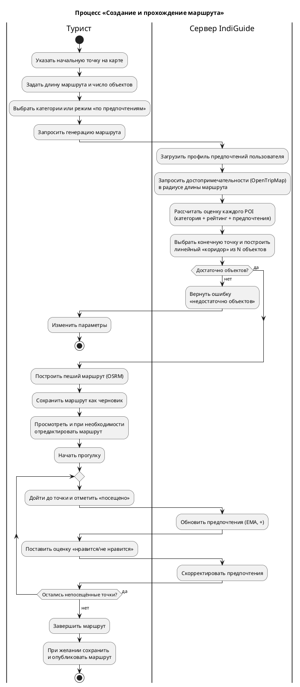

# Рисунок 4 — Диаграмма деятельности процесса «Создание и прохождение маршрута» (функциональная модель)

Вставьте код ниже в онлайн-редактор PlantUML (https://www.plantuml.com/plantuml).

```plantuml
@startuml
title Процесс «Создание и прохождение маршрута»

|Турист|
start
:Указать начальную точку на карте;
:Задать длину маршрута и число объектов;
:Выбрать категории или режим «по предпочтениям»;
:Запросить генерацию маршрута;

|Сервер IndiGuide|
:Загрузить профиль предпочтений пользователя;
:Запросить достопримечательности (OpenTripMap)
в радиусе длины маршрута;
:Рассчитать оценку каждого POI
(категория + рейтинг + предпочтения);
:Выбрать конечную точку и построить
линейный «коридор» из N объектов;
if (Достаточно объектов?) then (нет)
  :Вернуть ошибку
  «недостаточно объектов»;
  |Турист|
  :Изменить параметры;
  stop
else (да)
endif
:Построить пеший маршрут (OSRM);
:Сохранить маршрут как черновик;

|Турист|
:Просмотреть и при необходимости
отредактировать маршрут;
:Начать прогулку;
repeat
  :Дойти до точки и отметить «посещено»;
  |Сервер IndiGuide|
  :Обновить предпочтения (EMA, +);
  |Турист|
  :Поставить оценку «нравится/не нравится»;
  |Сервер IndiGuide|
  :Скорректировать предпочтения;
  |Турист|
repeat while (Остались непосещённые точки?) is (да)
->нет;
:Завершить маршрут;
:При желании сохранить
и опубликовать маршрут;
stop
@enduml
```
