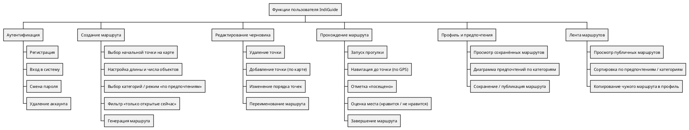

# Рисунок 6 — Дерево функций пользователя

Вставьте код ниже в онлайн-редактор PlantUML (https://www.plantuml.com/plantuml).
(WBS-диаграмма; нумерация рисунка — сквозная по тексту ВКР.)

```plantuml
@startwbs
* Функции пользователя IndiGuide
** Аутентификация
*** Регистрация
*** Вход в систему
*** Смена пароля
*** Удаление аккаунта
** Создание маршрута
*** Выбор начальной точки на карте
*** Настройка длины и числа объектов
*** Выбор категорий / режим «по предпочтениям»
*** Фильтр «только открытые сейчас»
*** Генерация маршрута
** Редактирование черновика
*** Удаление точки
*** Добавление точки (по карте)
*** Изменение порядка точек
*** Переименование маршрута
** Прохождение маршрута
*** Запуск прогулки
*** Навигация до точки (по GPS)
*** Отметка «посещено»
*** Оценка места (нравится / не нравится)
*** Завершение маршрута
** Профиль и предпочтения
*** Просмотр сохранённых маршрутов
*** Диаграмма предпочтений по категориям
*** Сохранение / публикация маршрута
** Лента маршрутов
*** Просмотр публичных маршрутов
*** Сортировка по предпочтениям / категориям
*** Копирование чужого маршрута в профиль
@endwbs
```
