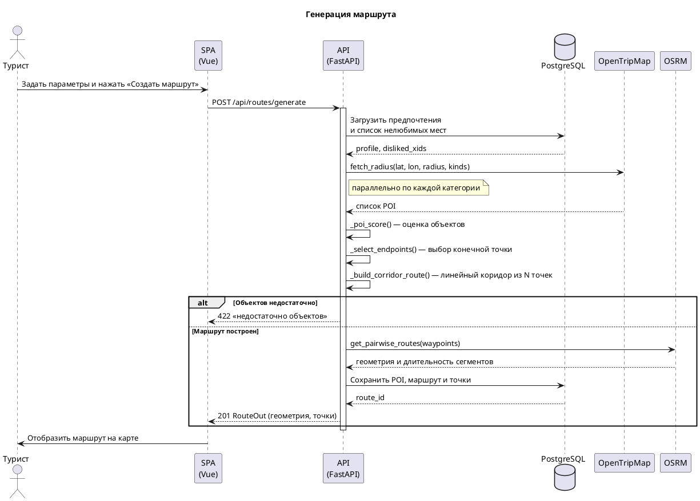

# Рисунок 7 — Диаграмма последовательности процесса «Генерация маршрута»

Вставьте код ниже в онлайн-редактор PlantUML (https://www.plantuml.com/plantuml).

```plantuml
@startuml
title Генерация маршрута

actor Турист as U
participant "SPA\n(Vue)" as SPA
participant "API\n(FastAPI)" as API
database "PostgreSQL" as DB
participant "OpenTripMap" as OTM
participant "OSRM" as OSRM

U -> SPA : Задать параметры и нажать «Создать маршрут»
SPA -> API : POST /api/routes/generate
activate API

API -> DB : Загрузить предпочтения\nи список нелюбимых мест
DB --> API : profile, disliked_xids

API -> OTM : fetch_radius(lat, lon, radius, kinds)
note right of API : параллельно по каждой категории
OTM --> API : список POI

API -> API : _poi_score() — оценка объектов
API -> API : _select_endpoints() — выбор конечной точки
API -> API : _build_corridor_route() — линейный коридор из N точек

alt Объектов недостаточно
  API --> SPA : 422 «недостаточно объектов»
else Маршрут построен
  API -> OSRM : get_pairwise_routes(waypoints)
  OSRM --> API : геометрия и длительность сегментов
  API -> DB : Сохранить POI, маршрут и точки
  DB --> API : route_id
  API --> SPA : 201 RouteOut (геометрия, точки)
end
deactivate API
SPA -> U : Отобразить маршрут на карте
@enduml
```
