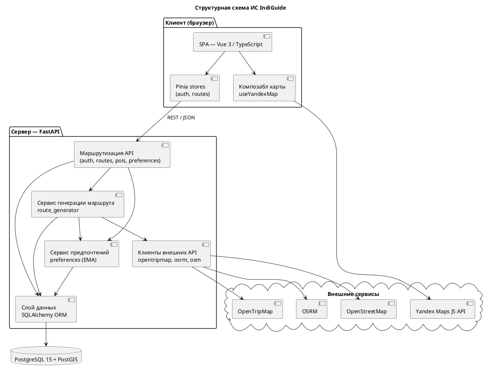

# Рисунок 8 — Структурная схема информационной системы

Вставьте код ниже в онлайн-редактор PlantUML (https://www.plantuml.com/plantuml).

```plantuml
@startuml
title Структурная схема ИС IndiGuide

package "Клиент (браузер)" {
  [SPA — Vue 3 / TypeScript] as SPA
  [Pinia stores\n(auth, routes)] as STORE
  [Композабл карты\nuseYandexMap] as MAP
  SPA --> STORE
  SPA --> MAP
}

package "Сервер — FastAPI" {
  [Маршрутизация API\n(auth, routes, pois, preferences)] as ROUTERS
  [Сервис генерации маршрута\nroute_generator] as GEN
  [Сервис предпочтений\npreferences (EMA)] as PREF
  [Клиенты внешних API\nopentripmap, osrm, osm] as CLIENTS
  [Слой данных\nSQLAlchemy ORM] as ORM
  ROUTERS --> GEN
  ROUTERS --> PREF
  GEN --> CLIENTS
  GEN --> PREF
  ROUTERS --> ORM
  GEN --> ORM
  PREF --> ORM
}

database "PostgreSQL 15 + PostGIS" as DB

cloud "Внешние сервисы" {
  [OpenTripMap]
  [OSRM]
  [OpenStreetMap]
  [Yandex Maps JS API] as YA
}

STORE --> ROUTERS : REST / JSON
MAP --> YA
ORM --> DB
CLIENTS --> [OpenTripMap]
CLIENTS --> [OSRM]
CLIENTS --> [OpenStreetMap]
@enduml
```
