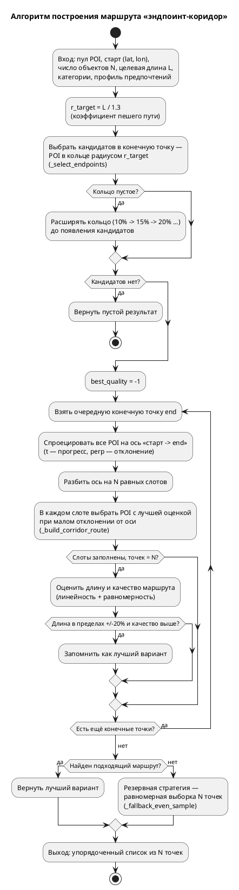

# Рисунок 9 — Блок-схема алгоритма «эндпоинт-коридор» построения маршрута

Вставьте код ниже в онлайн-редактор PlantUML (https://www.plantuml.com/plantuml).

```plantuml
@startuml
title Алгоритм построения маршрута «эндпоинт-коридор»

start
:Вход: пул POI, старт (lat, lon),
число объектов N, целевая длина L,
категории, профиль предпочтений;
:r_target = L / 1.3
(коэффициент пешего пути);
:Выбрать кандидатов в конечную точку —
POI в кольце радиусом r_target
(_select_endpoints);
if (Кольцо пустое?) then (да)
  :Расширять кольцо (10% -> 15% -> 20% ...)
  до появления кандидатов;
endif
if (Кандидатов нет?) then (да)
  :Вернуть пустой результат;
  stop
endif
:best_quality = -1;
repeat :Взять очередную конечную точку end;
  :Спроецировать все POI на ось «старт -> end»
  (t — прогресс, perp — отклонение);
  :Разбить ось на N равных слотов;
  :В каждом слоте выбрать POI с лучшей оценкой
  при малом отклонении от оси
  (_build_corridor_route);
  if (Слоты заполнены, точек = N?) then (да)
    :Оценить длину и качество маршрута
    (линейность + равномерность);
    if (Длина в пределах +/-20% и качество выше?) then (да)
      :Запомнить как лучший вариант;
    endif
  endif
repeat while (Есть ещё конечные точки?) is (да)
->нет;
if (Найден подходящий маршрут?) then (да)
  :Вернуть лучший вариант;
else (нет)
  :Резервная стратегия —
  равномерная выборка N точек
  (_fallback_even_sample);
endif
:Выход: упорядоченный список из N точек;
stop
@enduml
```
